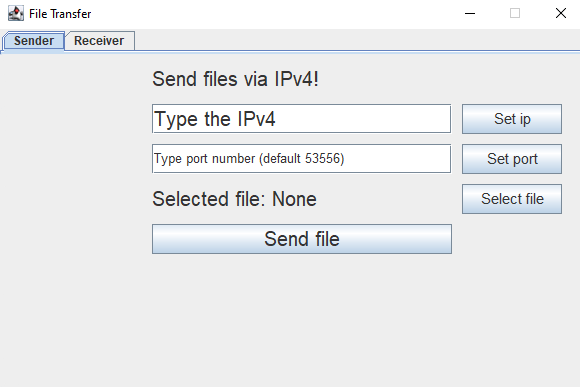

# Local File Sender

## Index

*   [Description](#description)
*   [Installation](#installation)
*   [Usage](#usage)
*   [Errors](#errors)
*   [Warnings](#warnings)
*   [Report a bug](#bug-report)
*   [Credits](#credits)

## Description

Local File Sender or, more simple, LFS is a java program made with Swing.  
The porpuse of it is to send file of all dimension from a pc to another with IPv4.  
It's a very user friendly program because all the option are visible and if something or some input is wrong, the program throw an GUI error with JOptionPane.  
Why i made it?  
Becuase i wanted to send a file from my local pc to another one, but i saw that none made a program like i wanted. (maybe because is useless **:/** ).

## Installation

### Windows

1.  Ensure you have [open JDK](https://openjdk.org/projects/jdk/17/) or [Java installed](https://www.oracle.com/java/technologies/javase/jdk17-archive-downloads.html) (version 17 or higher)
2.  Download the code for the [github page](https://github.com/Carpento/Local-File-sender/) or use git to clone it  `git clone https://github.com/Carpento/Local-File-sender.git`

## Usage

To use the **jar** program, go in the `jar\` and execute the command

`java -jar LFS.jar`  

To use the **java** program, go in the `src\gui\` and execute the command

`java LFS.java`

## Errors

Possible error messages that the user may see in the program:

*   Exception

Depends of what Exception is triggered in the program (Message in the panel when the exception happend).

*   Invalid ip

Triggered when the ip that the user want to set is invalid.

*   Invalid file path

Triggered when the user want send a file but the path isn't specified/selected.

*   Invalid Input

Triggered when the user write an invalid input for the port instead of a port number (integer).

Possible errors that the user may see in the log:

*   FileNotFoundException

Occurs when the specified file does not exist.

*   NullPointerException

Occurs when a program attempts to use an object reference that has not been initialized.

*   UnknownHostException

Occurs when the IP address of a host could not be determined.

*   IOException

Occurs when an input or output operation fails or is interrupted.

## Warnings

Possible warn that can be showed in the program

*   Sender service

The "sender service" isn't an error, is only the sender status service. But it can warn you if another sender thread is active and you want active another one.

*   Server service

The "server service" isn't an error, is only the server status service (like the sender service). But it can warn you if another server thread is active.

*   SocketTimeoutException

Triggered if the connection max timeout is reached or if the server is unavaible (so the client can't reach the server and the timeout start)

## Hash

MD5 :  f54fcd5c2d5d7b78954af152d2b0a5e1 

SHA-256 : 78b80f25cf522a17c1720a089211dcff10c1974c3291c6344086e91f696e5914

## Credits

### Java developer: [Carpento](https://github.com/Carpento)

### Html developer: [Carpento](https://github.com/Carpento)
